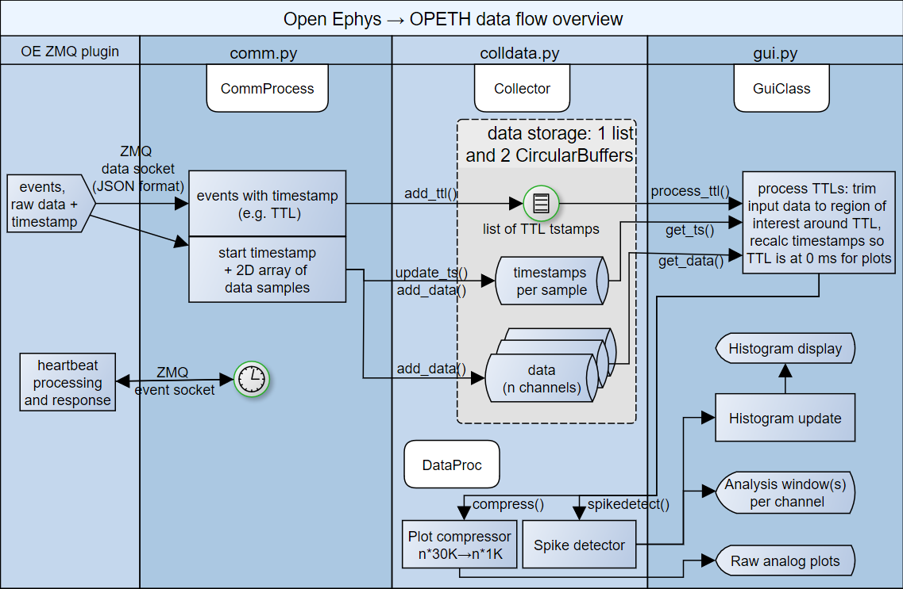

Architecture overview
=====================

This online documentation is associated with pre-print 'OPETH: Open Source 
Solution for Real-time Peri-event Time Histogram Based on Open Ephys' by 
András Széll, Sergio Martínez-Bellver, Panna Hegedüs and Balázs Hangya. 
DOI: https://doi.org/10.1101/783688.

Data acquisition: Open Ephys ZMQ plugin
---------------------------------------

Data acquisition and signal conditioning is performed by Open Ephys. OPETH 
implements spike thresholding itself, therefore a Spike Detector plug-in 
should not be included before the ZMQ interface. OPETH receives data from 
OE's ZeroMQ interface plugin. The plugin broadcasts recorded data and events 
that can be subscribed to by external applications. Timestamps accompanying 
these data and event packets are the sample index, which will get converted
to actual timestamp based on current sampling rate. 

The ZMQ Interface plugin opens a ZMQ publisher socket to allow one or more 
ZMQ clients to subscribe (connect) locally or over the network. Though the 
system is typically used with a single client connected locally, it is 
possible to use multiple OPETH clients on one or more PCs analyzing 
the same Open Ephys data source simultaneously with different settings. 
 
The ZMQ plugin uses JSON format data packets for the digitized data and 
event metadata (e.g. timestamp, event channel, number of data channels and 
sample count). Another socket for event  messages and responses is used 
for heartbeat messages to notify the plugin about the connected clients.
(Possibly for listing them on ZMQ plugin interface.)

Open Ephys - OPETH interface
----------------------------

Input data arriving from Open Ephys is handled by :mod:`opeth.comm`, which 
takes care of parsing the JSON structures containing the measurement samples
and trigger events. Depending on the type of the parsed input data, trigger 
events are stored in OpenEphysEvent objects (defined in openephys.py) and 
sample  data are stored directly in a 2D circular (or rolling) buffer 
implemented in :mod:`opeth.circbuff`; the data flow is managed by the 
:class:`opeth.colldata.Collector` class in :mod:`opeth.colldata.py`. 
(The :mod:`opeth.openephys` and some of the :mod:`opeth.comm` interface 
routines are based on the python samples created by Francesco Battaglia.)

The following figure summarizes the main data flow of OPETH:

OPETH GUI overview
------------------

Display windows currently available:

 - Main histogram / parameter setup
 - Raw analog data debug
 - Spike analysis window (opened by the **Open new spike win** button)

At startup, two windows are opened by default: the main histogram window 
displaying the online PETH results, and a raw analog data plot for debugging. 
The spike analysis window is a third view that makes it possible to visually 
differentiate between spikes and artefacts.

Histogram window
^^^^^^^^^^^^^^^^

The main GUI window is implemented in :mod:`opeth.gui`, which schedules data 
reading, spike discrimination, performs histogram calculation and enables the
adjustment of parameter setup.

Raw analog data window
^^^^^^^^^^^^^^^^^^^^^^
In the interest of CPU time, the plot is updated at a low frame rate and the 
data displayed are downsampled to 1000 Hz for this view.
Instead of relying on pyqtgraph's downsampling capabilities a different one
was used. The raw debug display was implemented in :func:`opeth.gui.GuiClass.update`, with min-maxed
data downsampling in :func:`opeth.colldata.DataProc.compress`.

Spike analysis window
^^^^^^^^^^^^^^^^^^^^^
Spike windows opened from the main histogram window and are handled by 
:mod:`opeth.spike_gui`.
Multiple Spike windows can be displayed simultaneously, but this is CPU 
intensive.

Logging
^^^^^^^
Log files are created automatically.
