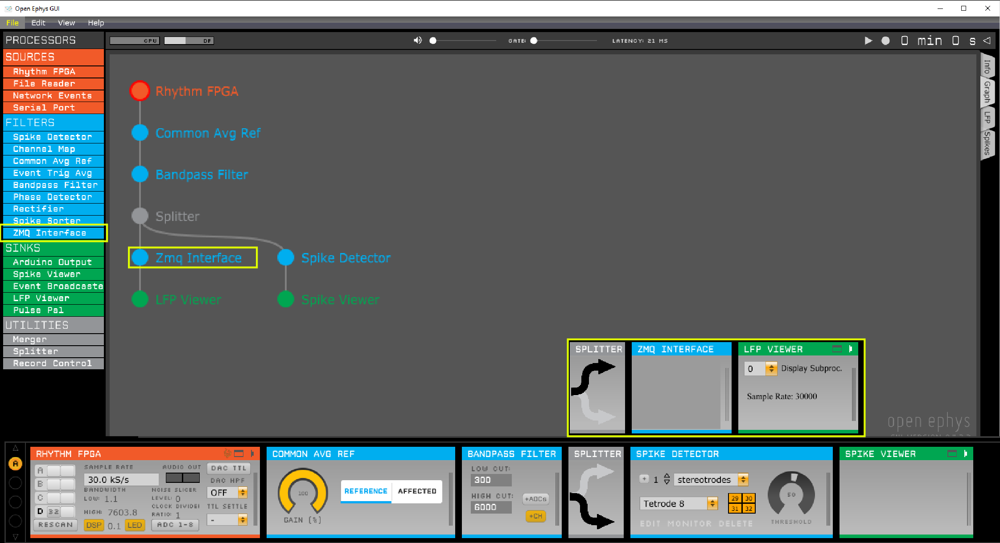
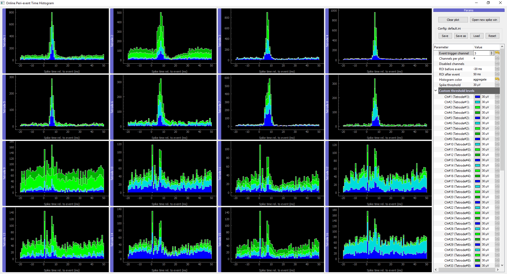
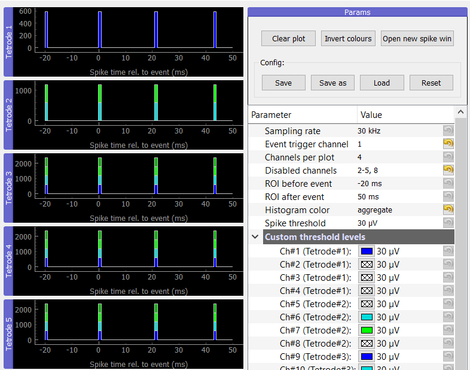
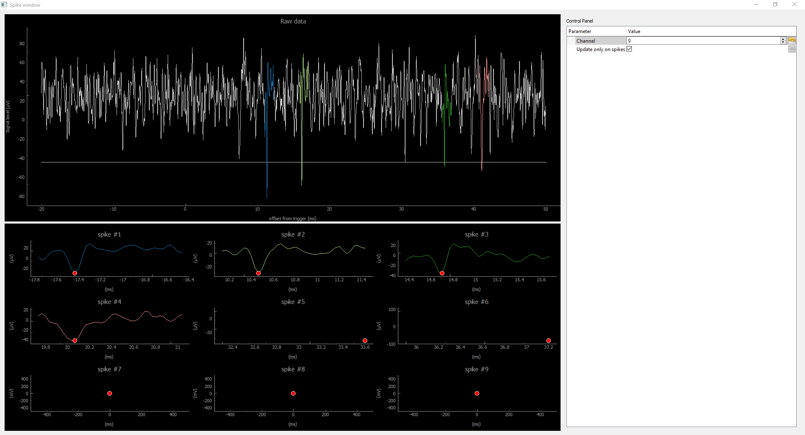

Using OPETH
===========

This online documentation is associated with pre-print 'OPETH: Open Source 
Solution for Real-time Peri-event Time Histogram Based on Open Ephys' by 
András Széll, Sergio Martínez-Bellver, Panna Hegedüs and Balázs Hangya. 
DOI: https://doi.org/10.1101/783688.

*OPETH was tested under Windows only. Feedback is welcomed for other platforms.*

Connecting OPETH to Open Ephys
------------------------------

OPETH relies on data and events recorded and timestamped by Open Ephys. These
data are broadcasted by Open Ephys through the ZMQ Interface plugin. 

 * Signal conditioning/filtering should be performed by Open Ephys, therefore 
   the ZMQ plugin should be placed after appropriate filters. E.g. Band-pass 
   filtering between 600-6000 Hz enables threshold-based action potential detection.
 * Spikes are detected by OPETH, so a spike filter plugin in OE is unnecessary 
   for OPETH.
 
Sample OE signal chain for ZMQ broadcasting:

OPETH connects to the local data and event ports of the ZMQ plugin. It is 
possible to run multiple OPETH instances with different settings 
simultaneously. (Connecting over the network could also be possible but not 
implemented in the GUI currently.)

OPETH graphical interface
-------------------------

The GUI consists of three different type of windows currently:

 * **Main histogram window:** The main window displays histograms, parameters and 
   buttons for handling the configuration and the different plots.
 * **Raw analog data window:** real time data view displays data arriving from
   Open Ephys, used for debugging (e.g. to determine whether spikes are absent 
   due to triggering issues or because of data content).
 * **Spike analysis windows:** Opened from main window. Displays detected spikes 
   for a single channel for visual spike/artefact observations.

Online Peri-event Time Histogram (main window)
^^^^^^^^^^^^^^^^^^^^^^^^^^^^^^^^^^^^^^^^^^^^^^

A view of an actual recording session performed with OPETH with PETHs on
the left side and UI buttons/params on the right:

Synthetic data and parameters close-up with tetrode #1 displaying channel 1,
tetrode #2 displaying ch 6 and 7 only:

The histograms are pyqtgraph elements so by dragging their title they can be 
rearranged or by double clicking even detached from the main window.

Parameter description:

 * **Sampling rate:** should match Open Ephys Rhythm FPGA settings. 
   (Will be read-only after fixing a bug preventing accessing this info.)
 * **Event trigger channel:** the OE trigger channel. Can be a TTL pulse source
   e.g. PulsePal or BPOD event triggers. (Technically non-TTL signals can also
   be reported by OE as timestamped event.)
 * **Channels per plot:** channels are collected in groups of four by default 
   as for classical tetrode recordings, but can be set from 1 to 8 (for single 
   electrodes, stereotrodes etc.) Changing it automatically changes the number 
   of histograms displayed.
 * **Disabled channels:** disable channels that are not to be spike-filtered, e.g.
   noisy or inactive channels. See screenshot for accepted formats. 
 * **ROI before/after event:** region of interest around trigger. Only this 
   part of the analog data is spike filtered.
 * **Histogram color:** 
 
    * *flat* histogram merges spikes from all channels of the given tetrode
    * *aggregate* (default) view displays channels in distinct colors but 
      in the same histogram bin, 
    * *channels* display a line plot for each channel separately.
 * **Spike threshold:** threshold level can be applied globally or per channel.
   By default negative spikes are detected and the threshold levels in GUI are 
   considered absolute value.
   
If multiple triggers fall within the ROI, the same spikes may be detected for 
the triggers in the overlapping part.

OPETH automatically disables and hides the extra 3 channels if 35/70 channels 
are detected (disable by :attr:`opeth.gui.HIDE_AUX_CHANNELS`).

Plot handling buttons:

 * **Clear plot:** clears histogram windows.
 * **Invert colours:** switch between black and white background for histogram
   plots. (Experimental.)
 * **Open new spike win:** initiate new spike analysis window.

Parameters can be saved and loaded into ini files, last used file is remembered
and reloaded upon startup.

Configuration handling buttons:

 * **Save/Save as:** store current configuration into file.
 * **Load:** open a different configuration when changing to a different 
   experimental project.
 * **Reset:** restore defaults.
   
Spike analysis window
^^^^^^^^^^^^^^^^^^^^^

If the *Update only on spike* option is selected, spike windows are updated 
when new spikes are detected within the ROI of the trigger; otherwise, spike 
windows are updated 5 times per second even when no spikes are present.

Raw data window
^^^^^^^^^^^^^^^

Displays data received directly from Open Ephys, allowing low-level 
visualization of input for debugging.

 * Channels are auto-scaled and do not provide information on actual voltage levels yet.
 * The top half of the window is a rolling display that plots all channels simultaneously.
   To zoom in, hold right mouse button and move the mouse.
 * The plot is updated at a low frame rate and the data displayed are downsampled to 1000 Hz.
 * The bottom part has a stimulus counter and presents analog data aligned to the trigger stimuli.
 * Window boundaries with respect to the trigger are set by the *ROI before event*
   and *ROI after event* parameters.
 * Can be closed if not required for debugging.
    
When the stimulus counter is not incrementing, no triggers are received and 
thus no spike detection will be performed (-> histograms not updated).
